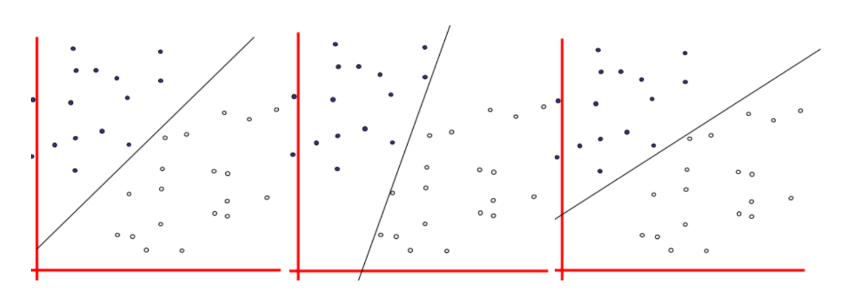
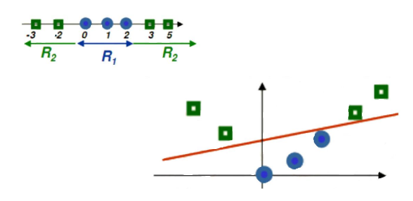
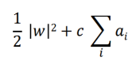
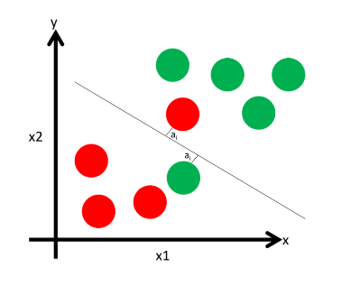
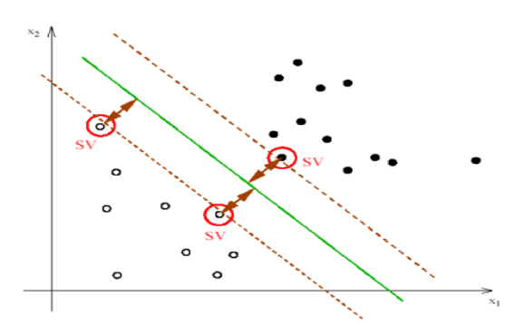
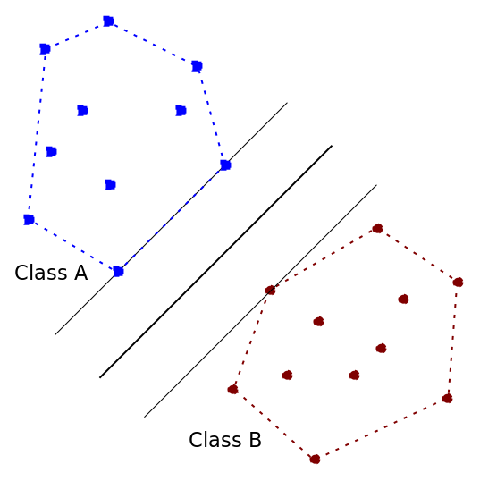

# Support Vector Machine
Algoritmo de **Classificação**!
Cria um hiperplano com base nos vetores de suporte para dividir as classes.



## Fórmula
Não Relevante.

## Hiperparâmetros
### Kernel Trick (Transformação dos Dados)  
Solução para quando os dados não podem ser separados por linha reta.

- Transforma dados em outra dimensão.
- Existem três tipos diferentes de kernel:
1. Kernel Linear
2. Kernel Polinomial
3. Kernel Gaussiano (RBF/Radial)

| Característica | Kernel Linear | Kernel Polinomial | Kernel Gaussiano (RBF) |
|----------------|---------------|-------------------|-------------------------|
| Fórmula | K(x, x') = x · x' | K(x, x') = (γ x · x' + r)^d | K(x, x') = exp(-γ ||x - x'||²) |
| Complexidade do Modelo | Baixa | Média a Alta | Alta |
| Capacidade de Capturar Não-Linearidades | Baixa | Média | Alta |
| Hiperparâmetros Principais | C | C, grau d, γ, coef0 r | C, γ |
| Risco de Overfitting | Baixo | Médio a Alto | Alto |
| Quando Usar | Dados aproximadamente lineares | Relações não-lineares moderadas | Estrutura muito não-linear ou desconhecida |
| Custo Computacional | Baixo | Médio/Alto | Médio |


### C (Penalizaçao dos Erros)
Pune as classificações incorretas do algoritmo.

- Faz o modelo ser mais rígido, mas pode se ajustar demais aos dados (Overfitting).
- C Alto = Tenta 100% da Separação
- C Baixo = Permite Mais Erros

## Código Base
```
svm = SVC(kernel=‘rbf’,C=2)
svm.fit(X_train, y_train)
prev = svm.predict(X_test)
```
## Métricas de Erro 
- Matriz de Confusão!
```
cm = ConfusionMatrix(svm)
cm.fit(X_train, y_train)
cm.score(X_test, y_test)
```
## Métricas de Desempenho
```
accuracy_score(y_test, prev)
```

# Resumo
- Procura forma de separar grande grupo de dados.
- Tenta encontrar linha (ou plano) para dividir os grupos.
- Escolhe a linha de maior distância entre os pontos do extremo.
- Cria uma "Zona de Segurança".

## Vetores de Suporte (SV)
São os dois pontos mais próximos (Um de Cada Classe) do hiperplano.
- Determinam a separação.
- A linha só vai se mover se um deles for movido.

## Convex Hull
Técnica que "estica um elástico" ao redor de cada grupo (Vira uma forma geométrica).

- Ignora pontos internos, usa apenas as bordas.
- A linha (Hiperplano) é posicionada entre as duas enoltórias convexas.
- Os pontos na borda são os vetores de suporte.